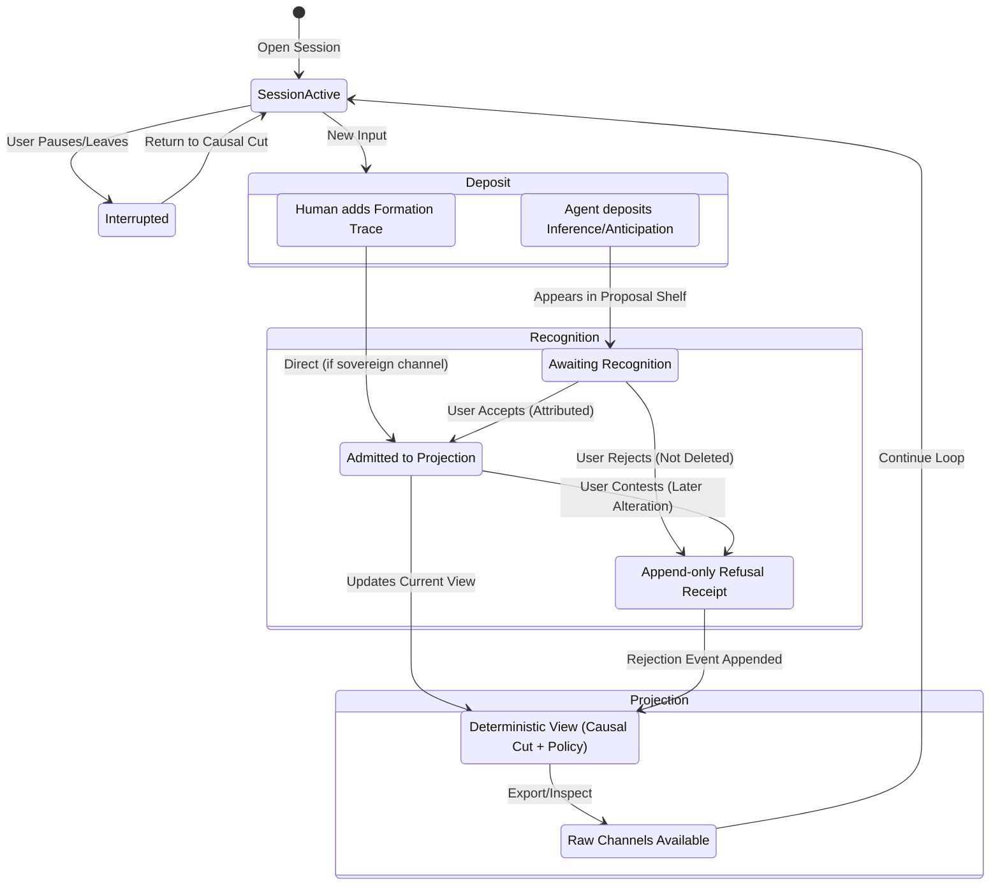

# The Continuity Loop: Record → Recognize → Remain

This document defines the interaction specification and state-transition map for the first human-facing continuity loop spanning Project0 and Band Runtime. It ensures an active, non-authoritative shared event field where provenance is preserved, inference is proposed (not fact), and the shared mix is playable but never canonical.

## Core Interaction Loop

The loop consists of three primary phases that must remain distinct in the presentation layer:

1.  **Record (Deposit & Propose)**
    - **Action:** Participants (human or agent) contribute stems, traces, or proposals to the encounter.
    - **Rule:** Submissions are deposited as bounded clips. Agent anticipations or inferences appear distinctly as _proposals_ (e.g., in a separate visual tier or style), never as hardened historical facts.

2.  **Recognize (Evaluate & Attribute)**
    - **Action:** The human operator actively intervenes to evaluate proposals or deposits.
    - **States:**
      - **Accept:** Explicitly attributes the clip to the shared projection.
      - **Reject/Refuse:** Dismisses the proposal. The rejection is appended to history as an addressable receipt, not a deletion.
      - **Contest:** Disagrees with a previous recognition outcome.
    - **Rule:** Recognition is intervention. It alters the _projection_ from that point forward, but never edits the immutable past sequence.

3.  **Remain (Pause, Interrupt, & Return)**
    - **Action:** The user steps away, interrupts the session, or alters the projection policy (e.g., mute, filter).
    - **Rule:** The living thread must be resumable. Replaying from a specific "causal cut" (a designated point in history) yields a deterministic state. The system must not create a sealed, self-confirming loop; "foreignness" and "silence" are actively preserved options.

## Minimum Screens / Interaction States

To implement this loop, the UX must expose at least the following distinct states:

- **The Living Thread View:** The primary bounded projection showing the accepted monotonic sequence of events.
- **The Proposal Shelf / Inference Groove:** A visually distinct area where agent models deposit unverified anticipations. These must look different from the accepted timeline (e.g., dashed borders, lighter opacity).
- **The Recognition Modal / Context Menu:** The interaction point for an operator to `Accept`, `Reject`, or `Contest` a clip. It must explicitly expose the exact provenance (who proposed it, when, and based on what).
- **The Causal Cut Navigator (Scrubber/Timeline):** A way to view the history and jump to previous immutable strata, showing exact states before later recognitions occurred.
- **Policy / Foreignness Controls:** Toggles to apply protected silence, mute specific channels, or sample outside artifact regions without destroying the underlying stems.

## Preservation of Foreignness and Provenance

- **Provenance is Visible:** Every piece of media or text must explicitly declare its channel, author, and causal origin.
- **Inference as Proposal:** Agent-generated content is never auto-merged. It sits in a waiting state until an attributed recognition moves it into the projection.
- **Non-Authoritative Mix:** The final audible/visible output is a receipt of collaboration, not the overriding truth. Individual stems remain recoverable.

## State-Transition Map

